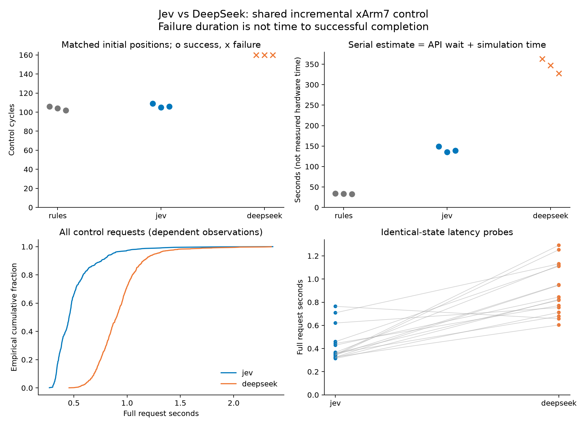
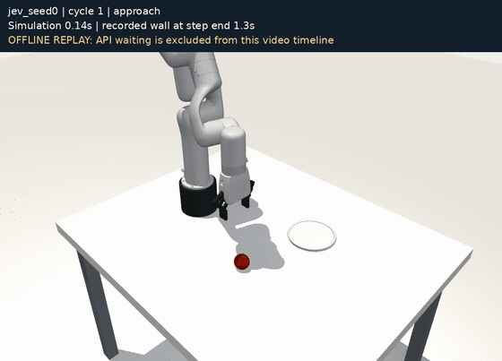
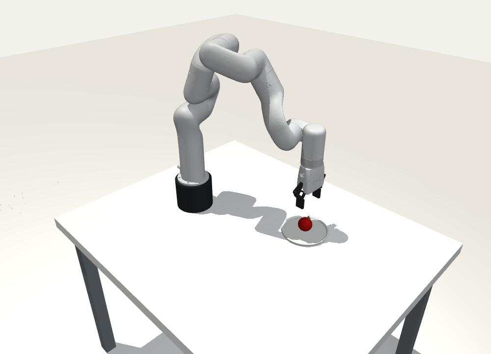
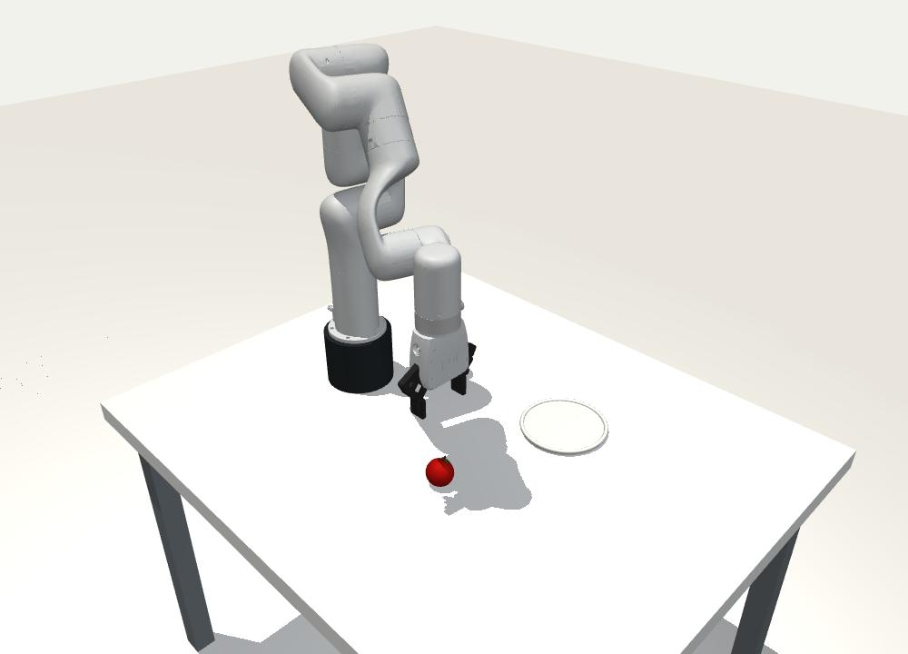

# Jev Robotic Arm Benchmark

### 让 Jev 真正一步步控制机械臂，会比快速 LLM 更好吗？

**中文** · [English](README.en.md)

我想验证的不是“AI 能不能说出抓取步骤”，而是它能不能每一步都作出正确的运动决定：该向哪边移、什么时候闭合夹爪、抓稳后能不能继续完成任务。

这次把 **Jev 1.13** 和 **DeepSeek Flash（关闭 thinking）** 接到同一个 xArm7 仿真里。两者使用相同的状态表示、动作选项、初始条件和物理控制器；决策分叉后，各自的闭环状态可以不同；另外保留一个直接执行规则的程序作为基线。**这是一个小规模、可离线复查的对比实验，不是通用机器人能力排行榜。**

结果很明确，也有明确边界：**Jev 完成了三个初始位置的任务，DeepSeek 在当前配置下三个都未完成；规则程序同样全部完成。**

## 先看结果

| 方案 | 成功 | 三局控制步数 | 同状态请求中位耗时 | 含探针的费用估算 |
|---|---:|---|---:|---:|
| **Jev 1.13** | **3/3** | 109 / 105 / 106 | **0.359 秒** | **$0.05481** |
| DeepSeek Flash | 0/3 | 160 / 160 / 160，达到上限 | 0.834 秒 | $0.23388–0.46775 |
| 规则程序 | 3/3 | 106 / 104 / 102 | 不调用模型 | $0 |

- 延迟来自 **16 对完全相同输入的交替请求**，Jev 有 15 对更快。它是本机到官方服务的完整请求时间，含网络和服务等待，**不是纯模型推理耗时**。
- 费用是实际 token 用量按公开单价估算，**不是账户账单**。两模型实际请求数不同：Jev 主实验640次、DeepSeek960次，各另加16次探针。
- 三个种子只是同一任务的初始位置小幅变化，**不是三种独立任务**。不把上千次相关请求当作上千个机器人试验。
- DeepSeek 没有完成，因此这里**不报告“成功完成任务快了多少倍”**。预设探索门槛通过的是成功数量差异分支。



## 视频：成功和失败都保留



*首页 GIF 为约 3 倍速的仿真运动预览，省略 API 等待；不代表实际控制速度。完整成功和失败视频如下。*

同一任务：把苹果抓起来、放进盘子、松开夹爪并向上撤回。

| Jev：完成 | DeepSeek：水平对准后停滞 |
|---|---|
| [](media/jev_seed0.mp4) | [](media/deepseek_seed0.mp4) |
| [播放／下载 Jev 视频](https://github.com/Dililianxice/jev-robotic-arm-benchmark/raw/refs/heads/main/media/jev_seed0.mp4) | [播放／下载 DeepSeek 视频](https://github.com/Dililianxice/jev-robotic-arm-benchmark/raw/refs/heads/main/media/deepseek_seed0.mp4) |

**视频是记录动作的离线物理重放，省略 API 等待。** 画面同时标注仿真时间和记录的步骤结束墙钟时间。Jev 这局实际墙钟约123秒，视频约35秒；DeepSeek 这局实际墙钟约324秒，视频约51秒。不能拿播放速度当真实控制延迟。

DeepSeek 的失败不是接口报错：三局都收到了正常回答。它在水平对准苹果后，垂直方向仍需下降，却反复选择 XYZ 全部保持，最终达到160步上限。完整失败记录与成功记录一起发布。

## Jev 究竟控制了什么？

每个控制循环有两次模型请求：

1. 读当前结构化状态，选择接近、抓取、抬升、搬运、下降、松开、撤回或完成。
2. 根据该意图，选择 X/Y/Z 的正向、保持或反向，以及夹爪打开、保持或闭合。
3. 共享程序计算小位移幅度、逆运动学和关节伺服；MuJoCo 更新接触与物体运动，返回下一步状态。

Jev 返回原生结构化选择和概率；本轮直接使用选择，不靠额外置信度筛选改善成绩。DeepSeek 只生成简短 JSON 标签，不要求长解释或自报概率。

这不是模型直接输出关节力矩，也不是一句 `pick_and_place()` 就完成整段动作。模型确实反复参与小步决策，但提示中已经写明抓取策略，精确坐标与接触状态也由仿真提供。

## 我怎样理解这个结果

**值得肯定的是：Jev 在这份冻结的小步决策接口里，比当前快速 DeepSeek 配置更可靠，同状态请求也更快。** 这是能复查的具体优势。

规则程序同样3/3，而且不需要模型请求，说明这个固定流程本来就能用程序覆盖。Jev 尚未在这里显示出优于专用控制器的必要性。

还需要保留几条限制：

- 原项目的问题组织方式面向 Jev 的分问题接口；DeepSeek 在一次生成请求里处理完整问题集合。**这不是已经优化到最佳的 DeepSeek 方案**，换提示或推理设置可能改变结果。
- 只有一个苹果、一个盘子和三个轻微位置变化；没有相机误差、未知物体、遮挡或复杂接触。
- 等 API 时，原仿真世界会暂停。它不验证动态目标和外力下的实时控制，也不代表 UR10 实机可以直接照搬。
- 本实验没有神经数据或真人闭环，不能据此声称提高了 BCI 解码能力。未来 BCI 是动机，当前证据属于任务执行层。

## 过程与复查

代码、模型版本、种子、160步预算和停止条件在新模型结果出现前冻结。先复现原项目的113步公开轨迹，再跑规则和三对模型实验；遇到服务或解析错误停止，不自动重试、不补抽成功。全部1632次请求正常返回，9局记录动作全部通过离线重放验证。

- [完整中文实验报告](docs/REPORT.zh.md) · [English report](docs/REPORT.en.md)
- [冻结方案](docs/PROTOCOL.zh.md) · [Methods in English](docs/METHODS.en.md)
- [逐局结果](results/episodes.csv) · [逐请求结果](results/requests.csv) · [同状态探针](results/matched_probes.csv)
- [数据与脱敏说明](docs/DATA.md) · [来源与版本](docs/PROVENANCE.json)
- [采集源码存档](archive/bench.py) · [离线验证程序](src/verify.py) · [发布包验证结果](results/publication_verification.json)

### 不需要密钥的离线复现

需要 Python 3.12。先克隆仓库，再执行：

```bash
python -m venv .venv
# Linux / macOS
source .venv/bin/activate
# Windows：.venv\Scripts\activate
python -m pip install -r requirements.txt
python src/summarize.py
python src/verify.py --output local_outputs/verification.json
```

验证器检查文件哈希、问题与动作对应关系、全部9局的物理轨迹、成功判据和16对探针。它**不读取凭据、不调用网络、不连接机械臂**。跨平台浮点误差容限为 `1e-7`，本机重放最大误差为0；不同运行时若超限会直接报告失败。

可选重新渲染：

```bash
python src/render.py jev_seed0 --output local_outputs/jev.mp4
```

渲染需要可用的 OpenGL 后端；Linux 无显示器可使用已配置的 EGL 或 OSMesa，例如 `MUJOCO_GL=osmesa`。不想配置渲染环境，直接观看仓库中的 MP4 即可。`archive/` 保留原采集逻辑供审阅，不是公开包的执行入口；本包默认不发起新的收费实验。

## 来源与贡献

本仓库由 **Dililianxice** 整理和发布。我的工作是官方 Jev／DeepSeek 同接口适配、配对比较、规则对照、同状态延迟探针、审计和结果整理；**xArm7 场景与增量控制框架来自 [OpenRoboto 的公开项目](https://github.com/openroboto-ai/jev-robot-control)**，固定提交 `7a4ed8b72c3c17d7aa790678ed9660df67c10dd3`。原项目的公开比较对象是 GPT-6 Astra 和 GPT-4.1 mini，不是 DeepSeek。

机器人模型源于 MuJoCo Menagerie／UFACTORY。许可证与版权声明完整保留，见 [第三方说明](THIRD_PARTY_NOTICES.md)。这是独立实验，非 TypeSafe、DeepSeek 或 UFACTORY 官方评测／合作项目。代码整理、分析和文档使用了 Codex 辅助，记录与结果经过程序验证及独立代码审查。

项目代码使用 MIT 许可证；机器人模型保留 BSD-3-Clause。引用信息见 [CITATION.cff](CITATION.cff)。
